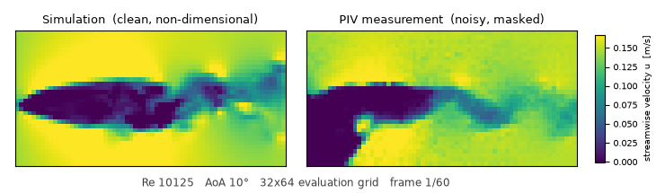
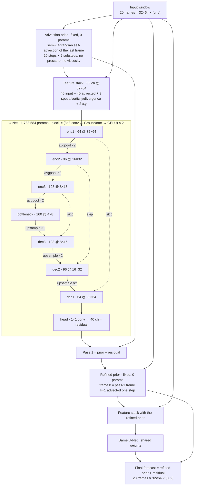
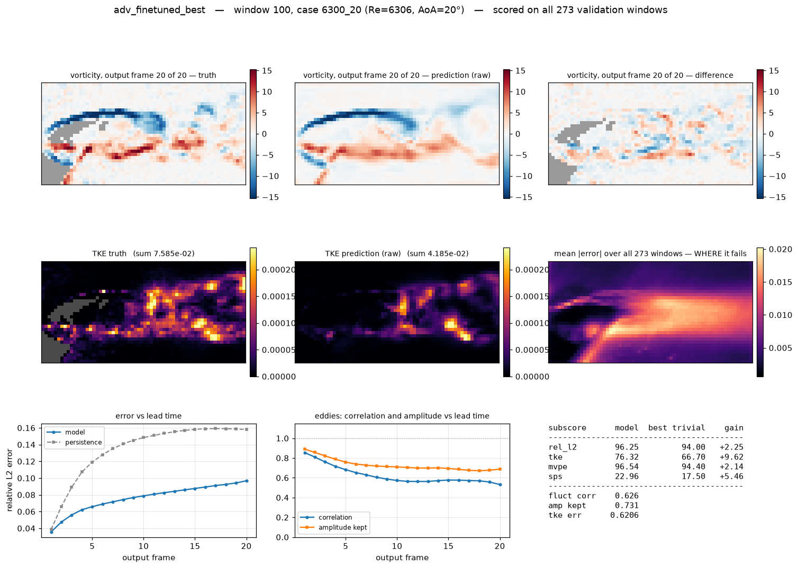

# RealPDE 2026 — forecasting a measured airfoil wake

Entry for the **NeurIPS 2026 RealPDE Competition**, both tracks:

- **Track 1 — Sim2Real**: learn from abundant simulation, deliver on scarce, noisy measurement.
- **Track 2 — LTTTA**: the same forecast as a streaming model that may adapt at test time.

Links: [competition site](https://realpdecompetition.github.io/) ·
[Track 1](https://www.codabench.org/competitions/17363/) ·
[Track 2](https://www.codabench.org/competitions/17385/) ·
[data release](https://huggingface.co/datasets/AI4Science-WestlakeU/RealPDE-Competition-Data) ·
[benchmark](https://github.com/AI4Science-WestlakeU/RealPDEBench)

## The task

Given 20 consecutive frames of the velocity field around a **NACA4418 airfoil**,
forecast the next 20.

```
input  (N, 20, 32, 64, 3)  ->  output  (N, 20, 32, 64, 3)
```

Each cell holds `[u, v, p]`. Pressure is never measured in the real data, so it
is zero there and is not scored. With `dt = 0.02 s` a window spans 0.4 s over a
21.9 × 10.8 cm field of view.

The measurements are time-resolved **Particle Image Velocimetry** in a water
tunnel; the simulated split is matched 3D CFD. Reynolds numbers span 3750–26700,
angles of attack 0°, 5°, 10°, 15°, 20°. **The hidden test set uses regimes that
appear in neither split**, which turned out to be the whole difficulty — see
[What the measurements showed](#what-the-measurements-showed).



*Same Reynolds number, same angle, same grid, same colour scale. Left: the
simulation — clean, sharp, complete. Right: what the camera recorded — grainy,
diffuse, with ~10% of cells lost to the laser shadow and to PIV dropouts. The
simulation is also non-dimensional, so it is multiplied by its own freestream
velocity before the two can be compared at all; without that they differ by up
to 7×. Learning from the left and delivering on the right is the competition.*

Entries are ranked by one `final_score` combining five published subscores —
relative L2, turbulent kinetic energy, mean velocity profile error, runtime, and
a Safe Prediction Score over uncertainty intervals. The combination rule is not
published; we recovered it by least squares from our own submissions (below).

## Result

| track | our best | leading entry |
|---|---|---|
| Track 1 (Sim2Real) | **78.858** | 82.101 |
| Track 2 (LTTTA) | **79.680** | 82.231 |

We finished short of the leaders. The gap is ~2.5–3.2 points, and the work below
established fairly precisely what it would have taken to close it: roughly a 30%
reduction in forecast error on unseen regimes. Nothing we found moved error by
more than a few per cent, so the repository is more useful as a record of what
was measured — including what does *not* work — than as a winning method.

## The model

Shapes, parameter counts and per-stage errors below were read out of the trained
checkpoint by `scripts/trace_model.py`, which also asserts that the traced stages
reproduce `model(x)` exactly.



Three choices carried the design:

1. **The network predicts a residual on a physics baseline.** 99.2% of a target
   window's energy is its steady temporal mean, so a network asked to reproduce
   the whole field spends its capacity on the part that copying already gets
   right. The baseline is the field transported along its own velocity.
2. **Physics enters as input, never as a constraint.** Advection, vorticity,
   divergence and strain all helped as input channels; the same quantities
   imposed as hard constraints or loss terms all hurt.
3. **One forward pass for all 20 output frames.** Rolling a one-step model
   forward accumulates error and costs 20× the time, and runtime is scored.

Per-stage error on held-out Reynolds numbers, in m/s:

| stage | RMS error |
|---|---|
| copy the last input frame (persistence) | 0.0174 |
| advection prior alone | **0.0328** |
| after pass 1 | 0.0125 |
| refined prior | 0.0139 |
| **final forecast** | **0.0102** |

The prior on its own is 1.9× *worse* than doing nothing — twenty advection steps
with no pressure term compound their own error — and is still the right baseline,
because what the network then has to learn is only what transport cannot explain.



*The report figure regenerated for every model: vorticity truth / prediction /
difference, TKE maps, where the error lives spatially, how it grows with lead
time, and how much of the fluctuation survives. Two things it made obvious: the
error is almost entirely in the wake band, and the predicted amplitude tracks the
correlation coefficient — the model is not under-sharpening, it is doing what MSE
asks of it.*

## What the measurements showed

Every number here is reproducible from a script in `scripts/`.

**There is no overfitting, and that was the key diagnosis.** Training error
0.0743, held-out Reynolds numbers 0.0779 — a 4.9% gap — while the hidden test set
sat at 0.1141, 46% worse. The model generalises fine; our *validation* was the
problem. Breaking it down by what is held out:

| validation protocol | rel_l2 error | vs. the easy protocol |
|---|---|---|
| interior Reynolds numbers (what we used for weeks) | 0.0775 | — |
| one angle of attack held out entirely | 0.0873 | ×1.126 |
| extreme Reynolds numbers held out | 0.0968 | ×1.249 |
| hidden test set | 0.1141 | ×1.472 |

The two effects multiply to ×1.407, which accounts for **87%** of the real gap.
The hidden set is unseen along *both* axes at once, and for most of the
competition we were measuring interpolation while being scored on extrapolation.
That single misalignment explains why four consecutive local improvements landed
flat or negative on the leaderboard.

**The scoring function was worth more than the model, up to a point.** The
scorer's default uncertainty band scores ~23 SPS; bands fitted per element from
the model's own residuals score ~49. After that the well is dry: an oracle that
knows each window's true error in advance buys **+0.30 SPS**, and one that knows
the error per lead time buys **+0.013**. Four separate calibration ideas died on
those two numbers.

**What a point of accuracy is worth.** Shrinking the residual artificially and
refitting everything gives the exchange rate (`scripts/sps_ceiling.py`):

| residual × | Δ final_score |
|---|---|
| 0.9 | +0.68 |
| 0.8 | +1.42 |
| 0.6 | +3.18 |

About 90% of that arrives through SPS rather than relative L2, because relative
L2 is already at 96/100 while SPS is at 49. It also sets the price of first
place: ~30% less error.

**The combination rule, recovered.** Least squares over eight submissions with
full subscores gives weights — SPS 0.277, runtime 0.098, and relative L2 / TKE /
MVPE poorly pinned because they barely vary. The runtime weight mattered: we had
been assuming 0.19 and rejecting changes on that basis. A later submission that
changed *runtime alone* measured it directly at **0.0967**.

**Runtime is a real axis, and at batch 1 it is launch-bound.** Capturing the
forward pass in a CUDA graph made Track 2's step 14× faster with bit-identical
outputs, worth **+0.70 final_score** on the leaderboard — the single largest
improvement in the project, and it changed nothing about the model.

**The flow itself.** Shedding frequency follows Strouhal across all 81
trajectories (`d ln f / d ln Re = +1.07`), so the period ranges from 5.6 to 145
frames and one 20-frame window contains between **0.14 and 3.55 shedding
cycles**. The same fixed-size task is 25× harder at one end of the parameter
range than the other.

### Dead ends, with the number that killed them

| idea | result |
|---|---|
| Per-window / per-lead-time / per-region interval calibration | oracle ceilings +0.30 and +0.013 SPS |
| σ-weighted loss (spend gradient where the metric pays) | −0.20 final |
| Vertical-mirror augmentation (doubles the angle axis) | −0.15 final |
| Temporal attention + Reynolds/angle conditioning head | −0.13 final on the leaderboard |
| FNO, and blending it with the U-Net | +0.14 local, negative blended |
| Test-time weight adaptation (Track 2) | nothing up to lr 0.01, diverges at 1 |
| Strain-scaled noise augmentation | neutral, −0.005 |
| TKE term in the loss | hurts rel_l2 more than it helps TKE |
| Empirically optimal interval bounds | +0.70 SPS local, −0.28 on the leaderboard |
| Hybrid with a numerical solver | not possible: no boundary conditions, no pressure |

## Repository layout

```
src/realpde/
  data.py          windowing, regime-disjoint splits (Re and/or angle), normalization
  models.py        U-Net, advection prior, scale conditioning, solver-in-the-loop
  advection.py     semi-Lagrangian transport, derived physics channels
  losses.py        MSE plus terms targeting the scored quantities
  sps.py           analytically optimal interval widths for the safety score
  local_score.py   wraps the organizers' scoring.py so local numbers are comparable

scripts/
  prepare_data.py       .h5 -> 32x64 float32 cache
  train.py              one training run; GPU duty cycling and a shared lock
  train_standard.py     the full recipe (sim pretrain -> real finetune), resumable
  test_models.py        checkpoints must reproduce their recorded scores exactly
  trace_model.py        stage-by-stage trace of a built model, with per-stage error
  model_report.py       the six-panel figure above, for any checkpoint
  sps_ceiling.py        what a given accuracy improvement is worth, in points
  bench_cuda_graph.py   eager vs. graph replay, alternating to beat clock drift
  build_submission.py   Track 1 archive + five-stage verification
  build_t2_submission.py  Track 2 archive, verified with the organizers' own harness
  ...                   plus ~40 one-question measurement scripts

submissions/     submission templates for both tracks, and packaging reports
checkpoints/     the checkpoints a submitted result rests on, and their sigma maps
figures/         model reports, flow visualizations, the flowchart source
```

Submission archives are verified before upload, because the development phase
allowed one per day: unpacked into a clean directory, imported with this project
off `sys.path`, run in a separate process, and scored with the organizers' own
scorer — Track 2 additionally through the organizers' streaming harness.

## Reproducing

```bash
python scripts/prepare_data.py                         # build the cache (~3.3 GB)
python scripts/test_data.py                            # shapes, splits, leakage
python scripts/train_standard.py --tag run1            # sim pretrain -> real finetune
python scripts/model_report.py --checkpoint checkpoints/run1_real_best.pt
python scripts/calibrate_sps.py --checkpoint checkpoints/run1_real_best.pt
python scripts/build_submission.py --checkpoint checkpoints/run1_real_best.pt \
       --tag run1 --bounds --sigma checkpoints/sps_sigma.npz
```

The 16 GB data release is not in this repository; download `train_real.tar.gz`
and `train_sim.tar.gz` from the Hugging Face link and unpack them into
`NeurIPS 2026 RealPDE Competition/`. Note that `train_real/7575_0.h5` duplicates
`6300_0` and is excluded — the organizers confirmed this on 2026-08-12.

Training holds GPU utilization near a target and pauses above a temperature
ceiling (`--gpu-duty`, `--max-temp`): the machine this was written on has a
failed GPU fan, which is also why every experiment here is small.

## Environment

The evaluation container is `pytorch/pytorch:2.2.2-cuda12.1-cudnn8-runtime`,
offline, with nothing installed at evaluation time. The local virtualenv matches
the versions that matter — torch 2.2.2+cu121, numpy 1.26 — so code that runs here
runs there. `h5py`, `scipy` and `einops` are absent from the container and must
never be imported from a `submission.py`.
